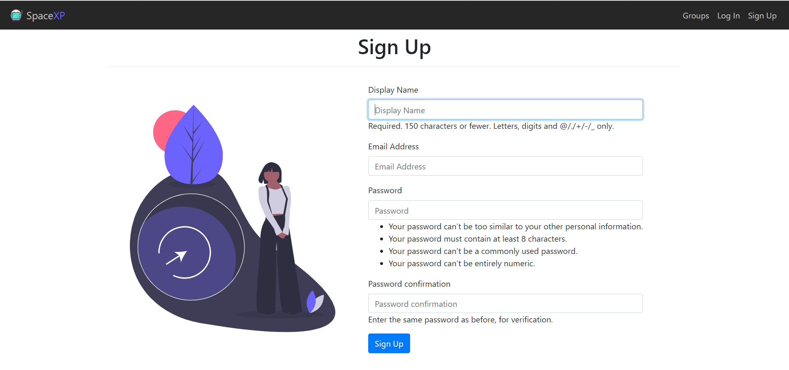

# SpaceXP
### A social media clone project
_This project is hosted on [AWS EC2](http://ec2-13-235-75-96.ap-south-1.compute.amazonaws.com)_

__An error while login/ signup OperationalError at /^accounts/login
attempt to write a readonly database__
> Tried chmod 777 db.sqlite3

> Tired sudo chown 664 db.sqlite3 
```
python manage.py migrate
python manage.py makemigrations
python manage.py migrate // for applying the changes made to the database
python manage.py runserver // for running the django server
python manage.py createsuperuser // for creating the superuser
```

#### In this project, three apps are used to build this web application completely and each have totally different functionality.
* ##### __Accounts:__  This application manages the accounts of the users and provide authentication and authorization (superusers only). All the account information is stored through the models in the database and can be managed through the Django admin page. The password of users is encrypted with a hash key which uses AES 256-bit encryption even the super user can’t see password of other users.
* ##### __Groups:__ This application manages the groups like creation or deletion of a group, member and post count in a particular group. The data of accounts app is used to know that who is logged in and in which group the user is present.
* ##### __Posts:__ This application handles the posts which are posted by the users and at which date and time. All this is done by the Django models and delivered to the templates using Django views.

__This is the landing page of the web application__
>

__Sign Up page__
>* The user has to provide his/her display name i.e. username which should be unique, valid email address, and password (must contain 8 character,
cannot be too similar with username, cannot be a commonly used password).  All this functionality of the form is provided by the Django.


__Log In Page__
> * The user can get authenticated from this page by entering his/her username and password and submitting the credentials. Django will verify the c
redential of the user if correct it will be logged in and if wrong an error message will be displayed.


__Home Page__
>

__Groups Page__
> * Groups template will help user to see all the available groups with the count of members and posts in the particular group on the right hand side of the page and on the left hand side is a greeting message with the username of the user. The user can click on any group and can join it. The user can delete posts from the group in which he/she is a member. The user can leave the group of which he/she is part of.

__Create Group Page__
> * Create Group template will help user to create a group with a group name and a description(optional) about the group.

__Group Post Page__
>

__Post Page__ 

> * Post template will help authenticated user to create a text post and can post it in a particular group by selecting it from the dropdown menu. The post will contain the date and time it was posted and by whom.


__Delete Post Page__
>

__Logout page__

>

__Django Admin Panel__

>

__Admin Dashboard__

>
>

__Django Users Page__

>
>
